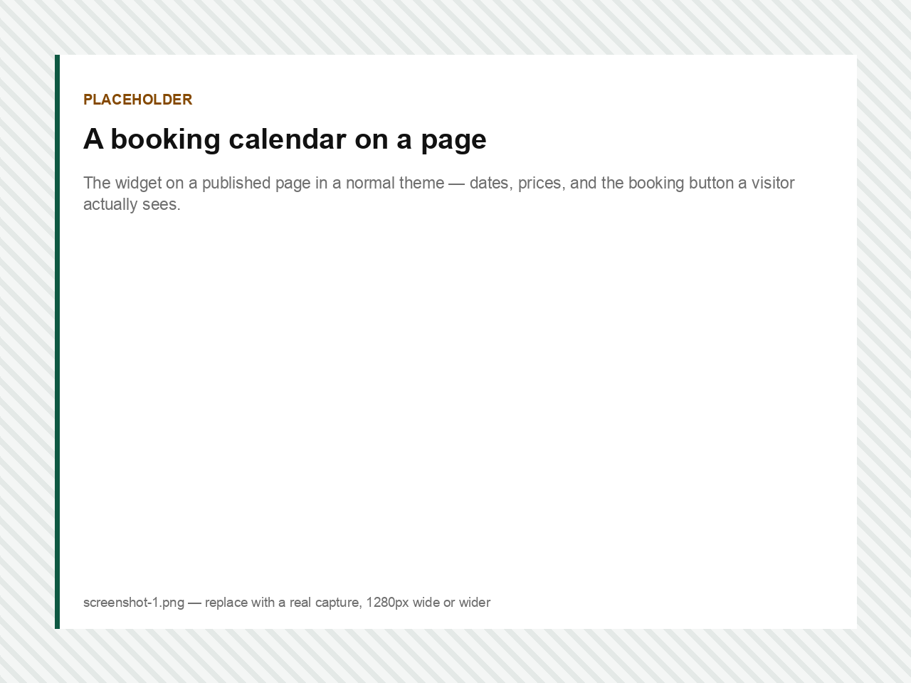
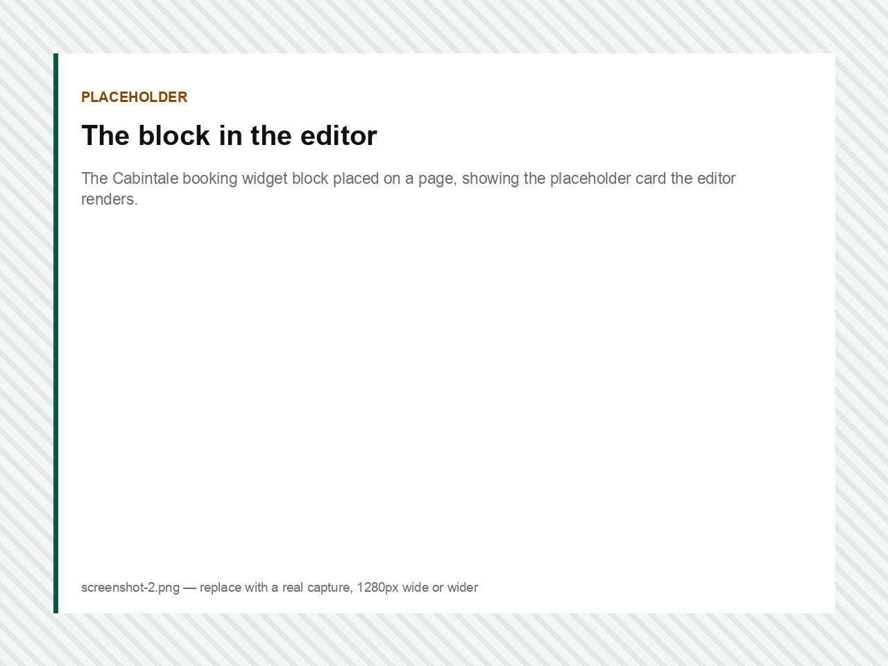
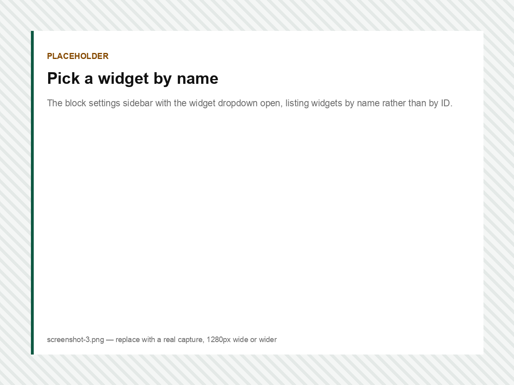
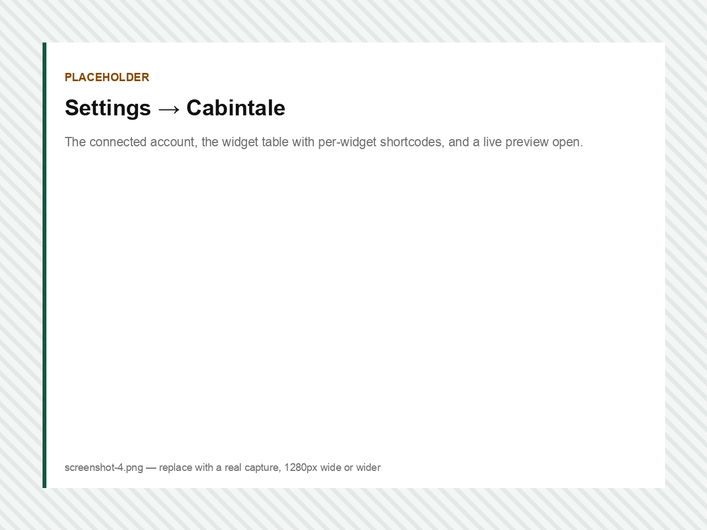
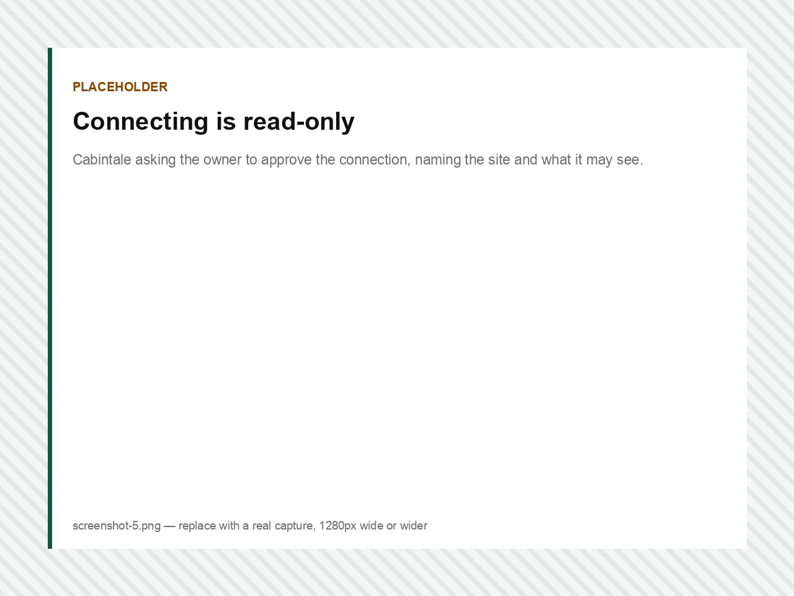

# Cabintale Booking Calendar

WordPress plugin that puts a [Cabintale](https://cabintale.com/) booking widget on a page as a Gutenberg block or a shortcode.

The user-facing documentation is [`readme.txt`](readme.txt) — that file is what the WordPress.org directory renders, so it is the one to keep current. This file is for people working on the plugin.

## What it looks like

> **The images below are placeholders.** They are generated stand-ins at the right dimensions, not real captures — see [Listing assets](#listing-assets) for how to replace them.

### A booking calendar on a page

What a visitor sees. The plugin's whole job is to get this onto the page and then stay out of the way.



### The block in the editor

The editor renders a placeholder card rather than the live widget — deliberately, see [Deliberate choices](#deliberate-choices).



### Pick a widget by name

Connected accounts get a dropdown of their own widgets. Unconnected ones can still paste a widget ID.



### Settings → Cabintale

The connected account, every widget with its own copyable shortcode, and previews that load only when clicked.



### Connecting is read-only

Cabintale names the site asking and states exactly what the token may see. It cannot read bookings, guests or payments, and it cannot change anything.



## How it fits together

The plugin does not implement any booking logic. It emits the `<cabintale-root>` element that Cabintale's own `widget-embed.js` looks for, and lets that script render the widget in an iframe.

```
block ─┐
       ├─→ Renderer::render() ─→ <cabintale-root data-token="…">
shortcode ─┘                     + enqueue widget-embed.js
```

One renderer, two entry points. The markup contract lives in exactly one file.

| Path | What it is |
|---|---|
| `cabintale-booking-calendar.php` | Header, constants, script registration, bootstrap |
| `includes/class-renderer.php` | The only place widget markup is produced |
| `includes/class-block.php` | Registers `cabintale/widget` |
| `includes/class-shortcode.php` | Registers `[cabintale_widget]` |
| `includes/class-settings.php` | Settings → Cabintale |
| `includes/class-connect.php` | PKCE handshake, stored token, widget list |
| `blocks/widget/` | `block.json` + `render.php` |
| `assets/js/editor.js` | Editor UI |
| `languages/` | `.pot` plus the bundled Czech translation |
| `.wordpress-org/` | Listing assets — never shipped in the plugin zip |

## Deliberate choices

**No build step.** `assets/js/editor.js` is plain JavaScript using `wp.element.createElement`, not JSX. The editor surface is a placeholder card and four controls; a toolchain would cost more than it returns, and unbuilt source is the easiest thing for a plugin reviewer to read.

**The block is dynamic, not static.** PHP renders the front end, so the markup is never stored in post content. That keeps one renderer shared with the shortcode, and it stops `wp_kses` from stripping `<cabintale-root>` for authors without `unfiltered_html` — the failure that makes copy-paste embed snippets unreliable on WordPress.

**The editor shows a placeholder, not a live widget.** The editor canvas is itself an iframe in current WordPress, and the booking dialog opens as a full-viewport `postMessage`-driven overlay. Nesting that inside the editor invites stacked-overlay bugs Cabintale has already paid for once.

**The app URL is not a setting.** It comes from the `CABINTALE_APP_URL` constant or the `cabintale_app_url` filter, so a low-privilege editor cannot repoint the script tag at a domain of their choosing.

**Widget IDs are shape-checked, not just escaped.** `Renderer::is_token()` requires a UUID before a value reaches an attribute.

**The stored token is read-only and scoped.** The connect handshake asks for `widgets:read` and nothing else, because the token lives in `wp_options` on a site nobody at Cabintale controls. It never reaches the browser: the exchange and every later call happen from PHP.

**The cached widget list carries a schema version.** `Connect::TRANSIENT_LIST` ends in a number. The transient holds already-mapped rows, so adding a key to them leaves a stale cache whose rows lack it — bump the number whenever the row shape changes.

## Local development

Point `CABINTALE_APP_URL` at your Cabintale install in `wp-config.php`:

```php
define( 'CABINTALE_APP_URL', 'http://admin.cabintale.local:8888' );
```

Then symlink this directory into your test site:

```bash
ln -s /path/to/cabintale-booking-calendar /path/to/wordpress/wp-content/plugins/cabintale-booking-calendar
```

### Checks before a release

Plugin Check is what the directory review runs, so run it first:

```bash
wp plugin install plugin-check --activate
wp plugin check cabintale-booking-calendar --exclude-files=.gitignore,.distignore --include-experimental
```

One warning is expected and deliberate: `load_plugin_textdomain()` is flagged as unnecessary since WordPress 4.6, but the Czech translation ships inside the plugin, and just-in-time loading only learned to resolve a bundled translation through the `Domain Path` header in WordPress 6.7. This plugin supports 6.3.

Regenerate translations after changing any user-facing string:

```bash
wp i18n make-pot . languages/cabintale-booking-calendar.pot
wp i18n update-po languages/cabintale-booking-calendar.pot languages/cabintale-booking-calendar-cs_CZ.po
# fill in the new msgstr, then:
wp i18n make-mo languages/ && wp i18n make-php languages/ && wp i18n make-json languages/ --no-purge
```

## Listing assets

`.wordpress-org/` holds what the WordPress.org listing shows. It is excluded from the plugin zip by [`.distignore`](.distignore), and `10up/action-wordpress-plugin-deploy` reads it from there.

Replace each file in place, keeping the exact filename — the names are what WordPress.org looks for, and the screenshot numbers must match the order of the captions in [`readme.txt`](readme.txt).

| File | Size | What it must show |
|---|---|---|
| `screenshot-1.png` | 1280px wide or wider | The widget on a published page, in a normal theme, with real dates and prices |
| `screenshot-2.png` | same | The block placed on a page in the editor |
| `screenshot-3.png` | same | The block sidebar with the widget dropdown open |
| `screenshot-4.png` | same | Settings → Cabintale: connected account, widget table, a preview open |
| `screenshot-5.png` | same | The Cabintale approval screen naming the site |
| `banner-1544x500.png` | exactly 1544×500 | Listing header. Keep text well inside the middle; the edges crop on small screens |
| `banner-772x250.png` | exactly 772×250 | The same artwork at 1× |
| `icon-256x256.png` | exactly 256×256 | Square icon |
| `icon-128x128.png` | exactly 128×128 | The same icon at 1× |

Shoot the screenshots on a real site with a connected account and a widget that has availability — an empty calendar in screenshot 1 undersells the plugin, and the settings screen looks unfinished without widgets in it. Keep browser chrome out of the frame.

### What the listing can and cannot show

The listing page is not a web page you control, and the two obvious assumptions about it are both wrong in opposite directions:

- **Inline images in the description do not work.** Markdown `` is not rendered; the handbook's advice is to "direct people to your own website" for documentation with images. Every picture on the listing comes from the Screenshots gallery, the banner and the icon — that gallery is what makes an image-rich listing look image-rich.
- **A video does work.** A YouTube or Vimeo URL alone on its own line is auto-embedded, and `[youtube URL]`, `[vimeo URL]` and `[wpvideo ID]` are accepted. Raw `<embed>`/`<object>` HTML is not, and a video cannot stand in for a screenshot in the Screenshots section.

If a demo screencast ever exists, put its URL on its own line just under the first paragraph of `== Description ==`:

```
Cabintale Booking Calendar puts your Cabintale booking widget on your WordPress site without touching any code.

https://www.youtube.com/watch?v=XXXXXXXXXXX
```

For this plugin the natural cut is about sixty seconds: install, connect, drop the block on a page, and a visitor booking a date.

## Related

The Cabintale side of this integration — the embed contract, the connect handshake and the read-only site API — lives in the `admin.cabintale` repository:

- `docs/embed-patterns.md` — the `<cabintale-root>` attribute contract this plugin depends on
- `docs/superpowers/specs/2026-08-01-wordpress-embed-plugin-design.md`
- `docs/superpowers/specs/2026-08-01-wordpress-connect-flow-design.md`
- `docs/superpowers/plans/2026-08-02-wordpress-plugin-launch.md` — what is left before the directory submission

## License

GPLv2 or later. See [LICENSE](LICENSE).
